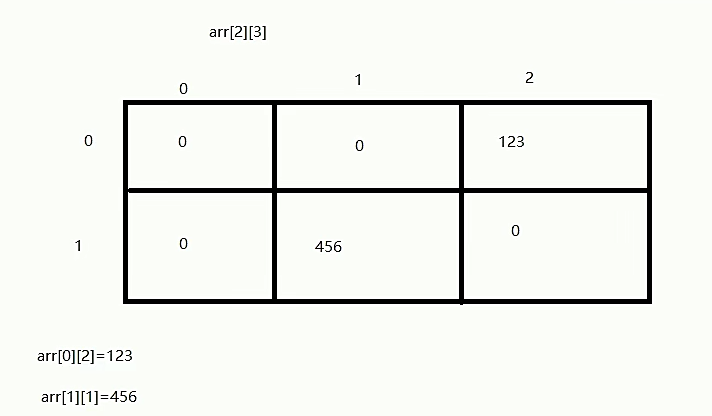

## 数组概念

- 是指一系列`同一类型数据`的集合

## 数组定义

- `var 数组名 [元素数量]类型`

- 在Go语言中，数组的命名遵循和其他类型相同的命名规范，命名时首字母大写或小写具有特定的含义

- 首字母大写（Public）：当一个变量（包括数组）的名称以大写字母开头时，这个变量是公开的，或者说是导出的（Exported）。这意味着其他包可以访问这个变量。在Go语言中，这是控制可见性（即公有和私有）的主要方式

- 首字母小写（Private）：当一个变量的名称以小写字母开头时，这个变量是私有的，即只能被定义它的包（Package）内部的代码访问

```go
var MyArray [5]int // MyArray 是一个公开的数组，可以被其他包访问
```

```go
var myArray [5]int // myArray是一个私有的数组，只能在定义它的包内部访问
```

## 二维数组定义

- `var 数组名 [x][y]类型`

- `x 代表行，y 代表 列`

